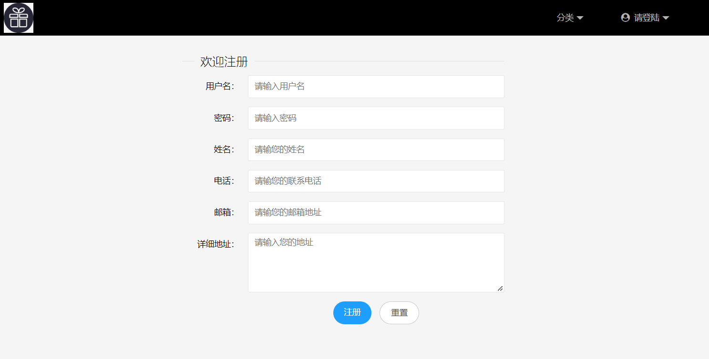

# **E-Commerce Trading Platform**

**E-Commerce Trading Platform** (Java, JPA, Thymeleaf, MySQL, Microsoft Visio, Ali Cloud)

•    Followed the NABCD (Need, Approach, Benefit, Competitors, Delivery) model to analyze the software requirements.

•    Designed E-R models, data flow diagrams, website prototypes, and use case diagrams utilizing **Microsoft Visio**.

•    Deliberated the database’s robustness and efficiency through MySQL triggers, indexes, views, and transactions.

•    Implemented the B/S structure via **Java + Thymeleaf + JPA + MySQL**. Deploy the website to the **Ali Cloud** for testing.